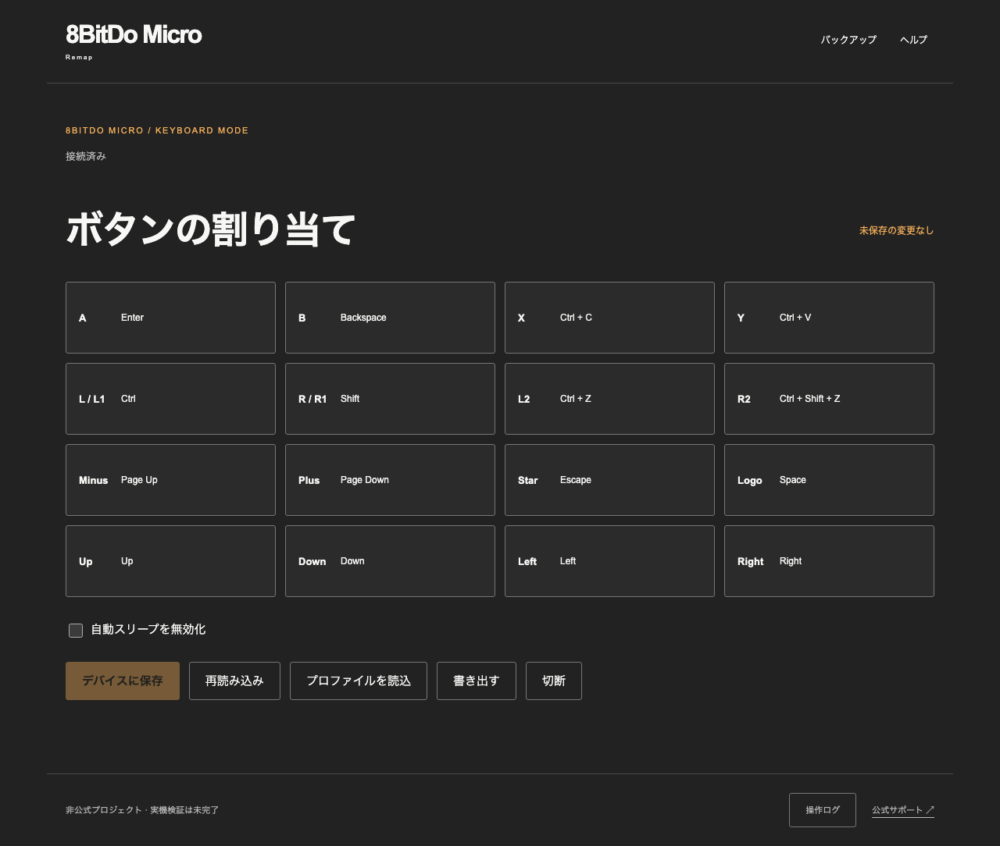
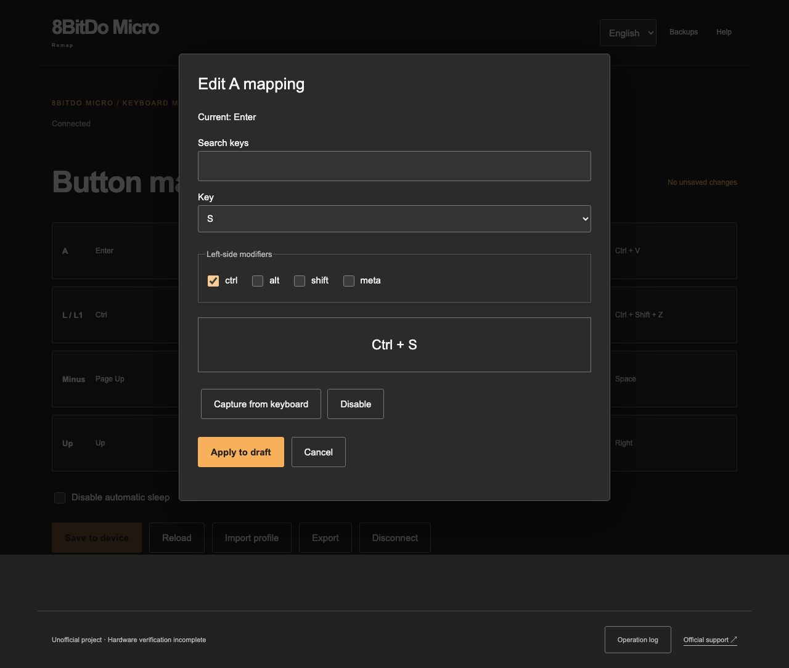
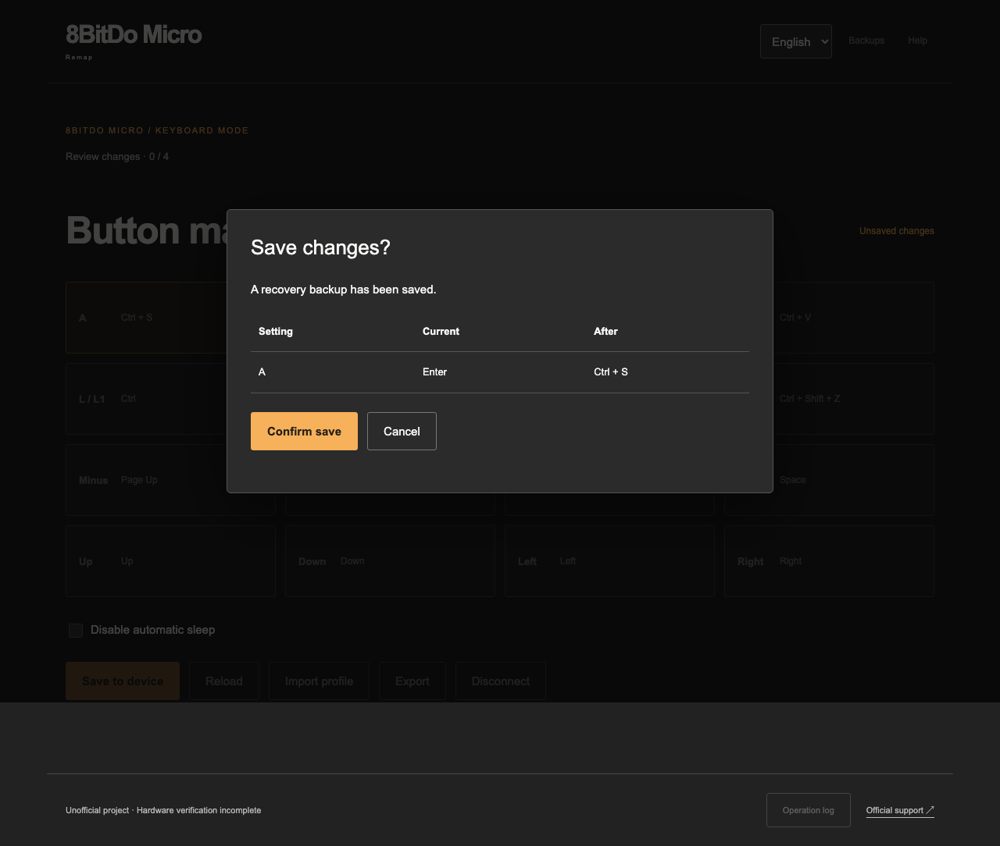

# 8BitDo Micro Remap

An unofficial, local-first keyboard configurator for the 8BitDo Micro. The React application communicates with the controller directly through Web Bluetooth; GitHub Pages serves static HTML, CSS, and JavaScript.

## See it in action

These screenshots show the actual application running with sample mappings and a simulated controller. They illustrate the UI, not a hardware verification result.

**1. Review all 16 button assignments.** Select a button to edit its keyboard action; import or export profiles from the same screen.



**2. Choose a key or capture a shortcut.** Here, physical A is being changed from Enter to Ctrl+S. Applying the change creates a local draft before anything is written to the controller.



**3. Review before saving.** The app creates a recovery backup and shows the before/after change. Writing starts only after confirmation.



## Run locally

Use Node.js 24 LTS and pnpm 10.33.2.

```sh
pnpm install --frozen-lockfile
pnpm dev
```

Open the printed localhost URL in Chrome or Edge. Production requires HTTPS. Windows, macOS, ChromeOS, and Android with Web Bluetooth support are the initial targets. Safari and Firefox are unsupported. Put the Micro in **K mode** and disconnect other configuration apps before selecting it in the browser chooser.

`docs/wireframe/index.html` is the static screen atlas. It can be opened directly and does not communicate with hardware.

## Configure

Select **日本語** or **English** in the header to change the interface language. Japanese is the default. The preference is stored in localStorage (`8bitdo-micro-remap.language`) and restored on your next visit. Switching languages preserves the current draft. If browser storage is unavailable, switching still works for the current session.

1. Connect and wait for a complete, CRC-validated read.
2. Select a physical button. Choose a key and up to three left-side modifiers, or capture a physical keyboard chord. Escape is a valid mapping. Capturing a normal key completes capture; releasing a modifier completes a modifier-only capture.
3. Apply to the local draft. Nothing has been written yet.
4. Choose **Save to device**. The app rereads the device, rejects changes since editing started, and persists a recovery backup.
5. Review the changes and confirm. The app sends four pages, commits, rereads every page, and reports **Verified** only when all four page CRCs validate and bytes 2–179 match. Device-updated bytes 0–1 are retained from readback; their meaning is still unknown.

Unknown mappings display as hexadecimal and remain untouched unless explicitly replaced. Unrecognized sleep values cannot be edited. Mouse actions, media keys, macros, S/D mode, USB configuration, and firmware updates are outside the first release.

## Backups and recovery

Backups are retained in this browser's IndexedDB until explicitly deleted. Clearing site data or using another browser loses access to them. A failed backup prevents configuration writes. A failed transfer prevents the commit command; a failed commit or readback is never reported as success.

If an operation fails, retain the backups, check power and K mode, reconnect, and reread. Select a backup if restoration is needed. Restoration first backs up the current configuration, then asks for confirmation. It restores **supported known fields only**, preserves the current unknown bytes, and lists skipped fields. It does not overwrite the full device payload from an older backup. Verification compares against the prepared overlay.

If recovery fails, disconnect the browser and inspect the controller in the official mobile app. A single-button save was checked on the investigation device and confirmed in the official app; restoration and broader hardware interoperability remain unverified; see [the verification record](docs/hardware-verification.md).

## Profiles

Export creates a named JSON file from the draft and retains the profile locally. Profiles contain all sixteen supported mappings and an optional confirmed sleep preference, without device identity or unknown raw fields. Export is rejected if a mapping is unsupported. Import validates the complete document and asks before replacing the draft; it never writes directly to the controller. Saved profiles can also be selected locally.

## Verification

```sh
pnpm format:check
pnpm lint
pnpm test:coverage
pnpm test:wireframe
pnpm build
pnpm exec playwright install chromium
pnpm test:e2e
```

E2E tests build in `e2e` mode and inject a scripted transport. They exercise the real application service, IndexedDB, and static production HTML. They do not automate the native Bluetooth chooser. A normal production build excludes the scripted device and its test hooks. E2E builds must never be deployed; the Pages job always creates and validates a fresh production build.

The CI workflow also runs `actionlint`; all action references are SHA-pinned. No automated dependency update workflow is enabled before hardware verification.

For semantic diagnostic information, run `VITE_DIAGNOSTICS=true pnpm dev` and open the operation log. This shows the phase, page count, and last notification length without raw packets, device names, or addresses.

## Deploy to GitHub Pages

The repository publishes at `https://whywaita.github.io/8bitdo-micro-remap/` after changes reach `main`. In repository Settings → Pages, select **GitHub Actions** as the source. The CI workflow deploys only main-branch pushes after both validation jobs pass, with scoped Pages/OIDC permissions. Pull requests never deploy.

`pnpm build` creates `dist/` with asset URLs under `/8bitdo-micro-remap/`. The deploy job builds afresh so the fake-device E2E artifact cannot be published. For local production preview:

```sh
pnpm build
pnpm preview --host 127.0.0.1 --port 4174
```

Open `http://127.0.0.1:4174/8bitdo-micro-remap/`. Development remains available with `pnpm dev` at the server root. The UI uses in-page state, so no server-side SPA route fallback is required; unknown paths return 404.

Production HTML contains a restrictive CSP meta tag and a `no-referrer` meta tag. The CSP excludes inline scripts, eval, plugins, foreign resources, base URLs, and form submissions. A meta policy cannot enforce `frame-ancestors`; GitHub Pages does not provide application-controlled response headers, so the previous Worker header guarantees are not claimed. Web Bluetooth defaults to same-origin access and still requires HTTPS (or localhost), a supported browser, and a user gesture. Browser storage is origin-scoped: other sites under the same `whywaita.github.io` origin share the browser's security boundary; a separate custom domain provides origin isolation.

No backend, Cloudflare account, Worker, Wrangler, or health API is required. Device configuration is never sent to the hosting provider by the application. Actual public deployment and full hardware verification remain separate from automated checks; see the [implementation ledger](docs/implementation-status.md).

## Protocol provenance

The implementation is independently written from protocol facts in [the design](docs/design.md), the USB HID Keyboard/Keypad usage table, and public sanitized observations:

- [MicroKey Studio protocol notes](https://github.com/WhiteCAN/8bitdo-micro-windows-keymapper/blob/main/docs/protocol-notes.md)
- [Public observed CRC vectors](https://github.com/WhiteCAN/8bitdo-micro-windows-keymapper/blob/main/tests/MicroKeyStudio.Protocol.Tests/MicroCrc16Tests.cs)
- [8bitult](https://github.com/Thoxy67/8bitult)
- [USB HID Usage Tables 1.6](https://www.usb.org/sites/default/files/hut1_6.pdf)
- [Official Micro support and visual reference](https://support.8bitdo.com/ultimate/micro.html)

No community implementation code or official logos/images were copied. Unknown initialization bytes are reproduced only as documented observations and are not interpreted or generalized.
